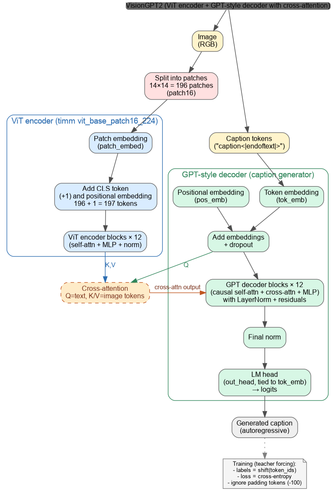

## MyLLM ViT → GPT2 Captioning (`MyLLM_Vit_gpt2_captioning.py`)

This project adds **image captioning** on top of the previous **MyLLM** work by combining:

- **ViT encoder** (pretrained, from `timm`): converts an image into a sequence of visual tokens (patch tokens + CLS token).
- **GPT-style decoder** (MyLLM building blocks): generates a caption autoregressively.
- **Cross-attention**: injects image information into the text stream (**Q=text**, **K/V=image tokens**).

In other words: it is **finetuning with images** on top of the earlier MyLLM Transformer implementation.

### How it extends `MyLLM`

This script reuses the “from scratch” Transformer components from the earlier project:
- `MyLLM/ch3.py`: `MultiHeadAttention` (causal self-attention for the caption tokens)
- `MyLLM/ch4.py`: `FeedForward`, `LayerNorm` (decoder MLP + normalization)

It differs from `MyLLM/MyLLM_nominal.py` (text-only wrapper) because here the decoder also attends to **image tokens** via cross-attention.

### Architecture diagram



### Data assumptions

The code expects a Flickr30k-style layout under the repo `data/` folder:

- `data/results.csv`
- `data/flickr30k_images/` (image files referenced by `results.csv`)

In the script, these are loaded via:
- `data_dir = REPO_ROOT / "data"`
- `image_dir = data_dir / "flickr30k_images"`

### How to run (minimal)

From repository root:

```bash
source venv/bin/activate
python MyLLM_Vit_gpt2_captioning/MyLLM_Vit_gpt2_captioning.py
```

Optional: choose a different HuggingFace GPT-2 checkpoint repo by setting:

```bash
export HF_GPT2_REPO=openai-community/gpt2
```

### Outputs

- Best checkpoint is saved to: `captioner/captioner.pt`
- The script also plots:
  - training/validation loss
  - training/validation perplexity
- Finally, it runs a small demo loop (sample images + generated captions).

### Notes / limitations

- This code is intended for **GPU** training (captioning is compute-heavy).
- If you move the repository, update `REPO_ROOT` near the top of the script.


